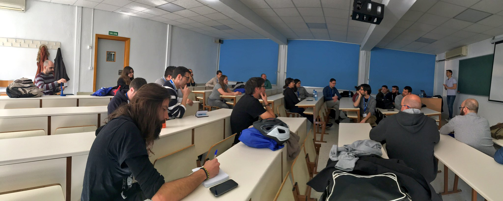

# Women in the tech industry (discussion)

During the open space Software Crafters Madrid 2018, more than 20 of us exchanged perspectives about the topic: **“Women in the tech industry”**.

This repo contains:

- [session_notes.md](session_notes.md) covering what we talked about.
- [resources.md](resources.md) pointing to solid write-ups on **diversity** and **inclusive language**.

It would be nice to end up with a list of **actionable items** to be done / tried out in our teams, companies, organizations, and / or communities. 

Do you care about this and are willing to contribute? **Please get in touch!** We'd love to hear from you all :-)